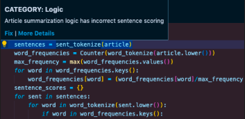
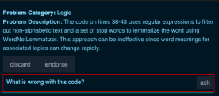
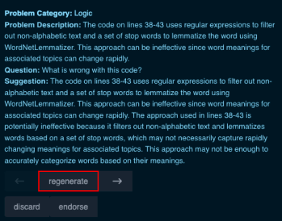
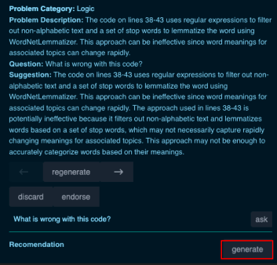
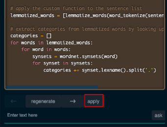
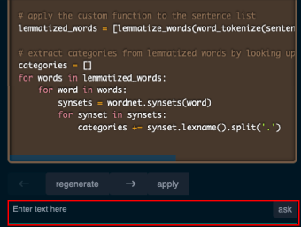
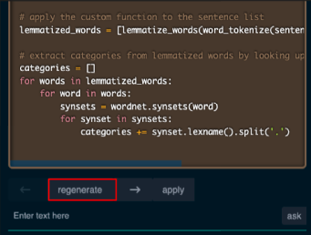

​
​
# Metabob​

This extension allows you to analyze Python code using a graph-attention-based neural network to detect and classify problematic code, and generate descriptions and code recommendations for the detected problems using an LLM of your choice.​ Supercharge your coding with AI-powered code reviews! 

Metabob analyzes all files of the project at once and automatically detects complex logical and contextual problems such as unhandled edge cases, memory leaks, and hundreds of other categories using Metabob’s proprietary neural network. Additionally, you can generate code recommendations for fixes and refactorings as well as ask questions about detections using an integrated LLM of your choice!​ 

Out of the box, Metabob uses a fine-tuned LLM model to generate problem descriptions and code recommendations for fixes and refactorings. If you’d like to change the integrated LLM, just go to the settings and input an api key to switch to using your preferred LLM.​
​
# Features
* Automatically detect and classify problems. 
* View problem descriptions to understand the detected problems
* Ask questions about the problem descriptions and pass in more context about your code to generate more accurate problem descriptions
* Generate code recommendations to fix the detected problems
* Ask questions about the code recommendations and/or pass in more context about your code to generate more context-sensitive code recommendations if needed
​​
# Settings​

* To disable Metabob anlaysis from running every time code is saved, go to the extension settings and deselect the checkbox under the text "Metabob: **Analyze Document On Save**"  

​
* To change the backend LLM model Metabob uses to generate problem descriptions and code recommendations, select your preferred model from the "Metabob: **Backend Selection**" drop down menu  

​
* If you prefer to use one of the openai models, you need to authenticate by inputting your openai API key into the text field under "Metabob: ChatGPT Token" text field on Metabob's extension settings  

# Usage​
​
1. Request an analysis by either saving the file (Metabob by default performs an analysis when a file is saved, this can be changed in settings) or by opening the command palette and choosing **_"Metabob: Analyze Document"_**  

​
2. Once the analysis is running, you can see a loading icon with a text "Metabob: Analyzing Document" on the bottom bar of VScode​  

​
3. Once the analysis has completed, you can see problematic code regions highlighted in red  

​
4. Hover over the highlighted area to open Metabob's pop-up box with problem category, short description of the problem, and commands **_"Fix"_** and **_"More Details"_**  

​
5. On the pop-up box, click **_"Fix"_** to open Metabob's extension panel to view more details about the problem and automatically generate a code recommendation for a fix **OR** click **_"More Details"_** to open the extension panel to just view more details about the problem  

​
6. You can **_"discard"_** the problem if you think it is invalid or useless. You can **_"endorse"_** the problem if you think it is valid or useful  

​
7. Ask questions about the problem description or pass in more context by using the text field below the problem description and clicking **_"ask"_** after  

​
8. After passing in more context, you can regenerate the problem description by clicking **_"regenerate"_**  

​
9. You can generate a code recommendation for a fix by clicking **_"generate"_** on the right side from **"Recommendation"**  

​
10. You can apply the code recommendation to your code by clicking **_"apply'_**  

​
11. You can ask questions and pass in more context for the code recommendation by using the text field below and clicking **_"ask"_**  

​
12. After passing in more context and asking questions, you can regenerate the code recommendation by clicking **_"regenerate"_**  

# Data Policy
​
Metabob deletes all data from it's problem detection model one hour after the user has made their last API call. However, as Metabob integrates with third party LLMs to generate problem descriptions and code recommendations to perform fixes, Metabob has to pass data to these models and cannot control how the data is used by the companies hosting these LLMs. ​
​
